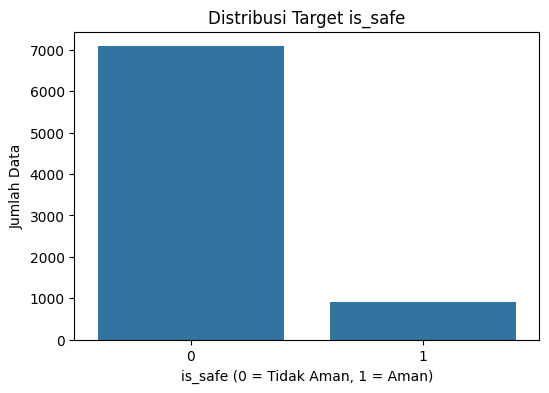
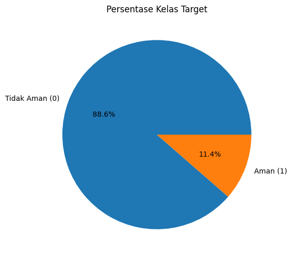
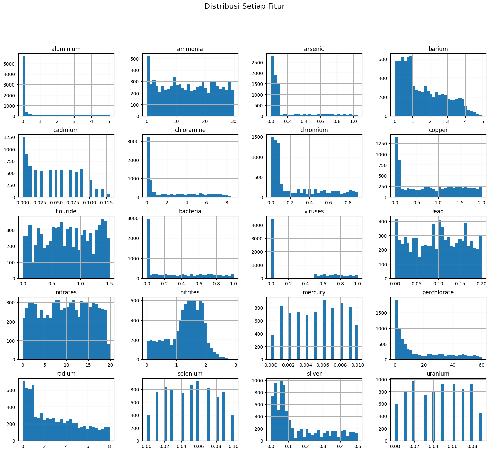
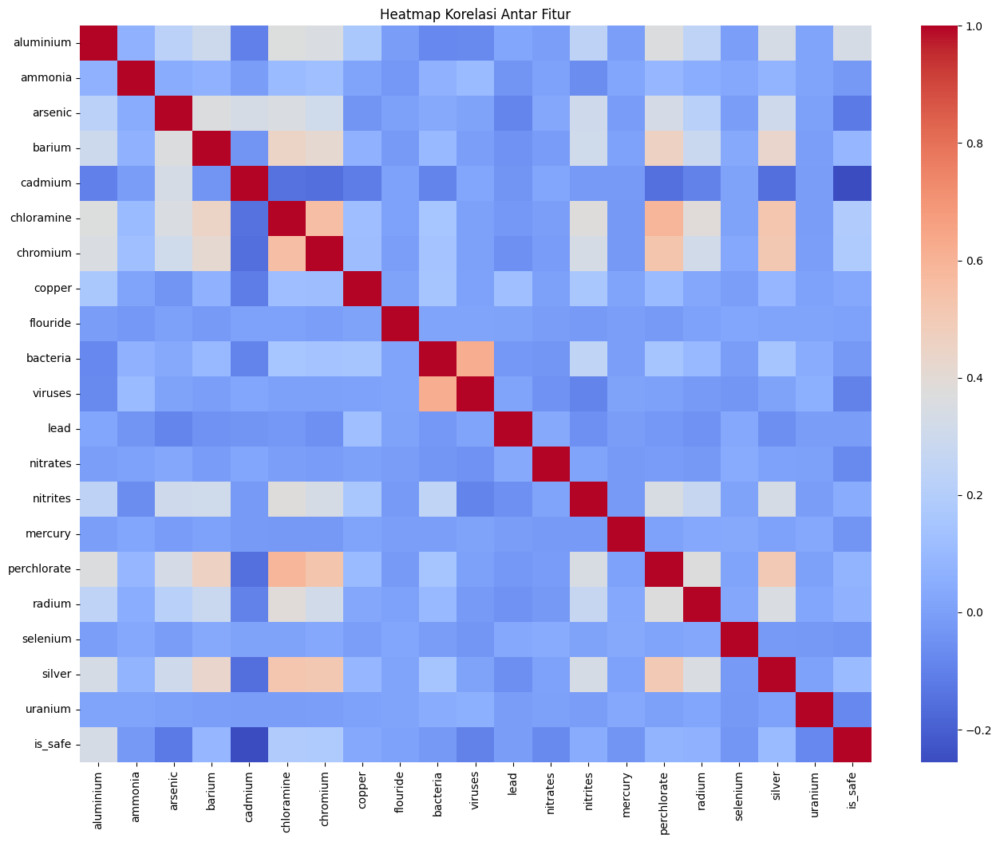
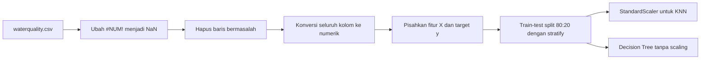
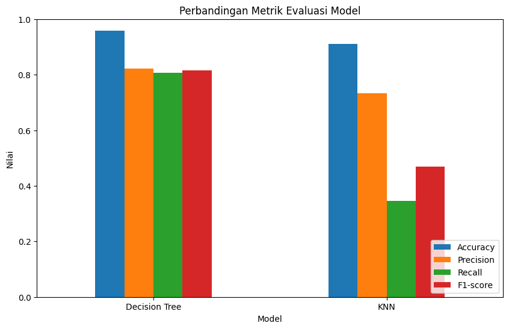
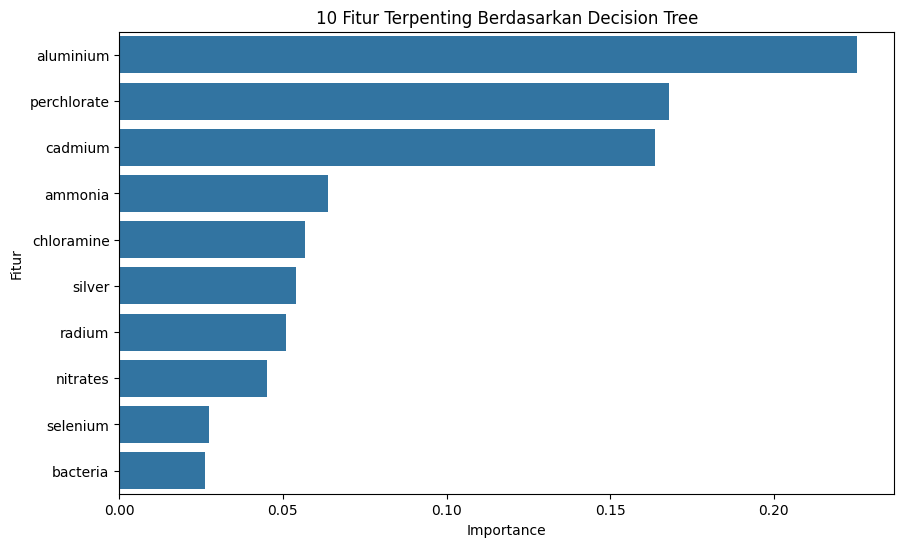
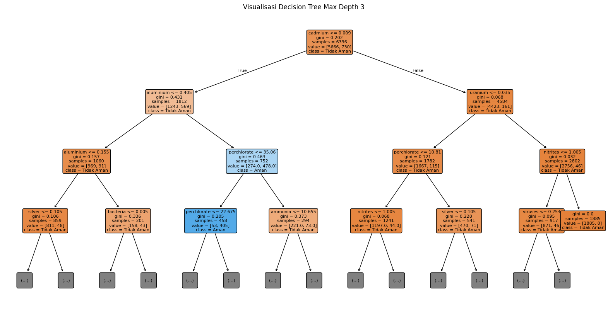
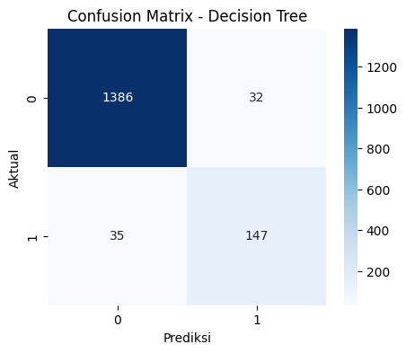
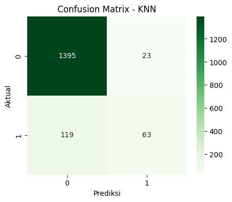

<a id="top"></a>

# Laporan UAS Kecerdasan Buatan

## 1. Judul Proyek

**Klasifikasi Kualitas Air Layak Konsumsi Menggunakan Algoritma Decision Tree dan K-Nearest Neighbor**

### Nama Kelompok

| Nama | Keterangan |
|---|---|
| Muhamad Rojaka | 2406027 |
| Yusrina Fauziyyah | Anggota 2 |

### Domain Proyek

Domain proyek ini adalah **kesehatan lingkungan dan kualitas air**. Air merupakan kebutuhan utama manusia, sehingga kualitas air perlu dipantau agar tidak membahayakan kesehatan. Dalam proyek ini, kecerdasan buatan digunakan untuk membantu mengklasifikasikan apakah air termasuk aman atau tidak aman berdasarkan kandungan kimia dan mikroorganisme yang terdapat pada sampel air.

Dataset yang digunakan adalah `waterquality.csv`. Dataset ini berisi fitur-fitur seperti aluminium, ammonia, arsenic, barium, cadmium, chloramine, chromium, copper, flouride, bacteria, viruses, lead, nitrates, nitrites, mercury, perchlorate, radium, selenium, silver, uranium, serta target `is_safe`.

<details open>
<summary><strong>Ringkasan Eksekutif Interaktif</strong></summary>

| Poin Utama | Hasil Cepat |
|---|---|
| Tujuan | Mengklasifikasikan kualitas air menjadi aman (`1`) atau tidak aman (`0`) |
| Dataset | `waterquality.csv` dengan 7.996 data bersih dan 21 kolom |
| Masalah utama | Data target tidak seimbang: 88,59% tidak aman dan 11,41% aman |
| Model dibandingkan | Decision Tree Classifier dan K-Nearest Neighbor |
| Model terbaik | Decision Tree Classifier |
| Performa terbaik | Accuracy 0,9581, precision 0,8212, recall 0,8077, F1-score 0,8144 |

</details>

<details open>
<summary><strong>Daftar Isi Interaktif</strong></summary>

| No | Bagian | Akses Cepat |
|---:|---|---|
| 1 | Judul Proyek | [Buka](#1-judul-proyek) |
| 2 | Business Understanding | [Buka](#2-business-understanding) |
| 3 | Data Understanding | [Buka](#3-data-understanding) |
| 4 | Exploratory Data Analysis | [Buka](#4-exploratory-data-analysis-eda) |
| 5 | Data Preparation | [Buka](#5-data-preparation) |
| 6 | Modeling | [Buka](#6-modeling) |
| 7 | Evaluation | [Buka](#7-evaluation) |
| 8 | Kesimpulan dan Rekomendasi | [Buka](#8-kesimpulan-dan-rekomendasi) |
| 9 | Referensi | [Buka](#9-referensi) |
| 10 | Lampiran | [Buka](#10-lampiran) |

</details>

<details>
<summary><strong>Dashboard Angka Utama</strong></summary>

| Area | Nilai | Interpretasi Singkat |
|---|---:|---|
| Data awal | 7.999 baris | Jumlah data sebelum pembersihan |
| Data bersih | 7.996 baris | Data yang digunakan untuk modeling |
| Data bermasalah | 3 baris | Berisi nilai `#NUM!` |
| Kelas tidak aman | 7.084 data | Kelas mayoritas |
| Kelas aman | 912 data | Kelas minoritas |
| Data uji | 1.600 data | Digunakan untuk evaluasi model |
| Fitur input | 20 fitur | Seluruh fitur numerik setelah cleaning |

</details>

<details>
<summary><strong>Checklist Kelengkapan Laporan</strong></summary>

- [x] Business understanding
- [x] Data understanding
- [x] Exploratory data analysis
- [x] Data preparation
- [x] Modeling Decision Tree dan KNN
- [x] Evaluation dengan confusion matrix dan metrik klasifikasi
- [x] Kesimpulan model terbaik
- [x] Lampiran dataset, notebook, dan grafik

</details>

---

## 2. Business Understanding

### 2.1 Permasalahan Dunia Nyata

Kualitas air yang buruk dapat berdampak pada kesehatan manusia dan lingkungan. Pemeriksaan kualitas air secara manual biasanya membutuhkan proses pengujian laboratorium, waktu, tenaga, dan biaya. Oleh karena itu, diperlukan sistem pendukung keputusan yang dapat membantu melakukan klasifikasi awal terhadap kualitas air berdasarkan data kandungan zat kimia dan mikroorganisme.

Permasalahan utama dalam proyek ini adalah bagaimana membangun model machine learning yang dapat memprediksi apakah suatu sampel air termasuk aman atau tidak aman berdasarkan parameter kualitas air.

### 2.2 Literatur Review

Penelitian terkait klasifikasi kualitas air menunjukkan bahwa metode machine learning dapat digunakan untuk membantu proses klasifikasi dan prediksi kualitas air. Nasir et al. (2022) membahas penggunaan berbagai algoritma machine learning untuk klasifikasi kualitas air dan menunjukkan bahwa pendekatan berbasis AI dapat membantu memperkirakan kualitas air secara lebih sistematis. Zhu et al. (2022) juga menjelaskan bahwa machine learning banyak digunakan dalam evaluasi dan prediksi kualitas air karena mampu menangani pola data yang kompleks dan non-linear.

Dalam proyek ini, algoritma Decision Tree dan K-Nearest Neighbor digunakan karena keduanya merupakan algoritma klasifikasi yang umum dipelajari dalam kecerdasan buatan. Decision Tree mudah dipahami karena menghasilkan struktur keputusan berbentuk pohon, sedangkan KNN bekerja berdasarkan kedekatan jarak antar data.

### 2.3 Tujuan Proyek

Tujuan dari proyek ini adalah:

1. Membangun model klasifikasi kualitas air berdasarkan dataset `waterquality.csv`.
2. Membandingkan performa algoritma Decision Tree dan KNN.
3. Mengevaluasi model menggunakan confusion matrix, accuracy, precision, recall, dan F1-score.
4. Menentukan model terbaik untuk klasifikasi kualitas air aman dan tidak aman.

### 2.4 Siapa User/Pengguna Sistem

Pengguna sistem yang dapat memanfaatkan proyek ini antara lain:

1. Petugas laboratorium kualitas air.
2. Pengelola instalasi air bersih.
3. Pemerintah atau instansi lingkungan hidup.
4. Peneliti di bidang kualitas air.
5. Masyarakat atau organisasi yang ingin melakukan analisis awal kualitas air.

### 2.5 Solusi dan Manfaat Implementasi AI

Solusi yang ditawarkan adalah model machine learning untuk klasifikasi kualitas air. Model ini dapat membantu melakukan prediksi awal terhadap keamanan air berdasarkan data parameter kimia dan mikroorganisme.

Manfaat implementasi AI pada proyek ini adalah:

1. Membantu proses analisis kualitas air secara lebih cepat.
2. Memberikan sistem pendukung keputusan untuk klasifikasi awal.
3. Mengurangi ketergantungan pada pemeriksaan manual untuk tahap screening awal.
4. Membantu memprioritaskan sampel air yang perlu diuji lebih lanjut di laboratorium.

[Kembali ke atas](#top) | [Lanjut ke Data Understanding](#3-data-understanding)

---

## 3. Data Understanding

### 3.1 Sumber Data

Dataset yang digunakan adalah file `waterquality.csv` yang disimpan pada folder `data/`. Dataset ini berisi data kualitas air dengan berbagai kandungan zat kimia dan mikroorganisme.

### 3.2 Ukuran dan Format Data

Informasi awal dataset:

| Keterangan | Nilai |
|---|---:|
| Jumlah data awal | 7.999 baris |
| Jumlah kolom | 21 kolom |
| Jumlah fitur input | 20 fitur |
| Target klasifikasi | `is_safe` |
| Format file | CSV |

Pada dataset ditemukan nilai error `#NUM!` sebanyak 3 baris pada kolom `ammonia` dan `is_safe`. Setelah data bermasalah dihapus, jumlah data yang digunakan menjadi 7.996 baris.

### 3.3 Deskripsi Fitur

| No | Fitur | Deskripsi Singkat |
|---:|---|---|
| 1 | aluminium | Kandungan aluminium dalam air |
| 2 | ammonia | Kandungan ammonia dalam air |
| 3 | arsenic | Kandungan arsenic dalam air |
| 4 | barium | Kandungan barium dalam air |
| 5 | cadmium | Kandungan cadmium dalam air |
| 6 | chloramine | Kandungan chloramine dalam air |
| 7 | chromium | Kandungan chromium dalam air |
| 8 | copper | Kandungan copper/tembaga dalam air |
| 9 | flouride | Kandungan fluoride sesuai nama kolom dataset |
| 10 | bacteria | Kandungan bakteri dalam air |
| 11 | viruses | Kandungan virus dalam air |
| 12 | lead | Kandungan timbal dalam air |
| 13 | nitrates | Kandungan nitrat dalam air |
| 14 | nitrites | Kandungan nitrit dalam air |
| 15 | mercury | Kandungan merkuri dalam air |
| 16 | perchlorate | Kandungan perchlorate dalam air |
| 17 | radium | Kandungan radium dalam air |
| 18 | selenium | Kandungan selenium dalam air |
| 19 | silver | Kandungan perak dalam air |
| 20 | uranium | Kandungan uranium dalam air |
| 21 | is_safe | Target klasifikasi kualitas air |

### 3.4 Tipe Data dan Target Klasifikasi

Target klasifikasi pada proyek ini adalah `is_safe`.

| Nilai Target | Keterangan |
|---:|---|
| 0 | Air tidak aman |
| 1 | Air aman |

Setelah proses pembersihan, seluruh fitur diubah menjadi tipe numerik agar dapat diproses oleh algoritma machine learning.

[Kembali ke atas](#top) | [Lanjut ke EDA](#4-exploratory-data-analysis-eda)

---

## 4. Exploratory Data Analysis (EDA)

<details open>
<summary><strong>Panel Navigasi EDA</strong></summary>

| Fokus Analisis | Visual | Insight Cepat |
|---|---|---|
| Distribusi target | [Lihat gambar](#gambar-distribusi-target) | Kelas `0` jauh lebih dominan dibanding kelas `1` |
| Distribusi fitur | [Lihat gambar](#gambar-histogram-fitur) | Skala fitur berbeda-beda sehingga KNN perlu standardisasi |
| Korelasi fitur | [Lihat gambar](#gambar-heatmap-korelasi) | Beberapa fitur lebih berkaitan dengan target dibanding fitur lain |
| Insight awal | [Baca insight](#44-insight-awal-dari-pola-data) | EDA menunjukkan kebutuhan cleaning, scaling, dan evaluasi metrik lengkap |

</details>

### 4.1 Distribusi Target

Distribusi target setelah data dibersihkan adalah:

| Kelas | Keterangan | Jumlah | Persentase |
|---:|---|---:|---:|
| 0 | Air tidak aman | 7.084 | 88,59% |
| 1 | Air aman | 912 | 11,41% |

Berdasarkan distribusi tersebut, dataset memiliki masalah **imbalanced class**, karena jumlah data air tidak aman jauh lebih banyak dibandingkan data air aman. Oleh sebab itu, evaluasi model tidak cukup hanya menggunakan accuracy, tetapi juga perlu menggunakan precision, recall, dan F1-score.

<details open>
<summary><strong>Lihat visual distribusi target</strong></summary>

<a id="gambar-distribusi-target"></a>



*Gambar 1. Distribusi jumlah data pada target `is_safe`.*



*Gambar 2. Proporsi kelas target `is_safe`.*

</details>

### 4.2 Distribusi Fitur

Visualisasi histogram digunakan untuk melihat sebaran nilai pada setiap fitur numerik. Beberapa fitur memiliki rentang nilai yang berbeda-beda, sehingga normalisasi diperlukan terutama untuk algoritma KNN yang sensitif terhadap skala data.

<details open>
<summary><strong>Lihat histogram seluruh fitur numerik</strong></summary>

<a id="gambar-histogram-fitur"></a>



*Gambar 3. Histogram distribusi setiap fitur numerik pada dataset kualitas air.*

</details>

### 4.3 Analisis Korelasi

Analisis korelasi dilakukan untuk melihat hubungan antar fitur dan hubungan fitur terhadap target `is_safe`. Berdasarkan korelasi terhadap target, beberapa fitur yang memiliki hubungan cukup terlihat adalah:

| Fitur | Korelasi terhadap `is_safe` |
|---|---:|
| aluminium | 0,3340 |
| cadmium | -0,2560 |
| chloramine | 0,1867 |
| chromium | 0,1823 |
| arsenic | -0,1234 |
| silver | 0,1028 |
| viruses | -0,0970 |
| barium | 0,0909 |
| perchlorate | 0,0757 |
| uranium | -0,0756 |

Korelasi positif menunjukkan bahwa kenaikan nilai fitur cenderung berhubungan dengan kenaikan peluang target `is_safe = 1`, sedangkan korelasi negatif menunjukkan hubungan berlawanan. Namun korelasi tidak selalu menunjukkan hubungan sebab-akibat, sehingga tetap diperlukan proses modeling.

<details open>
<summary><strong>Lihat heatmap korelasi</strong></summary>

<a id="gambar-heatmap-korelasi"></a>



*Gambar 4. Heatmap korelasi antar fitur dan target `is_safe`.*

</details>

### 4.4 Insight Awal dari Pola Data

Insight awal dari EDA adalah:

1. Dataset memiliki kelas target yang tidak seimbang.
2. Terdapat 3 data bermasalah berupa nilai `#NUM!`.
3. Semua fitur merupakan fitur numerik setelah proses konversi data.
4. Perbedaan skala antar fitur cukup besar, sehingga standardisasi diperlukan untuk model KNN.
5. Beberapa fitur seperti aluminium, cadmium, chloramine, chromium, dan arsenic memiliki korelasi yang lebih terlihat terhadap target dibandingkan fitur lainnya.

[Kembali ke atas](#top) | [Lanjut ke Data Preparation](#5-data-preparation)

---

## 5. Data Preparation

Tahapan data preparation yang dilakukan adalah:

<details open>
<summary><strong>Alur Data Preparation</strong></summary>



</details>

### 5.1 Pembersihan Data Bermasalah

Nilai `#NUM!` pada dataset diubah menjadi missing value (`NaN`). Setelah itu, data yang memiliki nilai kosong dihapus.

Jumlah data bermasalah:

| Keterangan | Jumlah |
|---|---:|
| Baris dengan nilai `#NUM!` | 3 |
| Data awal | 7.999 |
| Data setelah cleaning | 7.996 |

### 5.2 Pengecekan Duplikasi

Data duplikat diperiksa untuk mencegah data yang sama memengaruhi proses pelatihan model. Pada dataset ini tidak ditemukan data duplikat.

### 5.3 Encoding Data Kategorik

Dataset tidak memiliki fitur kategorik. Semua fitur berupa data numerik setelah proses konversi. Oleh karena itu, proses encoding seperti label encoding atau one-hot encoding tidak diperlukan.

### 5.4 Normalisasi atau Standardisasi

Standardisasi digunakan pada model KNN karena KNN menghitung jarak antar data. Jika skala fitur berbeda jauh, fitur dengan nilai besar dapat mendominasi perhitungan jarak. Standardisasi dilakukan menggunakan `StandardScaler`.

### 5.5 Split Data Train-Test

Dataset dibagi menjadi data latih dan data uji dengan rasio 80:20 menggunakan `train_test_split`. Parameter `stratify=y` digunakan agar proporsi kelas pada data latih dan data uji tetap seimbang mengikuti distribusi target asli.

[Kembali ke atas](#top) | [Lanjut ke Modeling](#6-modeling)

---

## 6. Modeling

### 6.1 Algoritma yang Digunakan

Pada proyek ini digunakan dua algoritma klasifikasi:

1. **Decision Tree Classifier**
2. **K-Nearest Neighbor (KNN)**

<details open>
<summary><strong>Panel Perbandingan Algoritma</strong></summary>

| Algoritma | Karakter Utama | Kebutuhan Khusus | Kelebihan pada Proyek |
|---|---|---|---|
| Decision Tree | Membentuk aturan keputusan berbentuk pohon | Tidak wajib scaling | Mudah dijelaskan dan performanya paling baik |
| KNN | Mengklasifikasikan berdasarkan kedekatan jarak | Perlu standardisasi fitur | Sederhana dan cocok untuk data numerik |

</details>

### 6.2 Alasan Pemilihan Algoritma

Decision Tree dipilih karena mudah dipahami dan dapat menunjukkan fitur yang berpengaruh dalam proses klasifikasi. Model ini bekerja dengan membuat aturan keputusan berdasarkan fitur yang tersedia.

KNN dipilih karena cocok untuk data numerik dan bekerja berdasarkan kedekatan jarak antara data baru dengan data latih. Namun, KNN membutuhkan standardisasi fitur agar perhitungan jarak lebih adil.

### 6.3 Implementasi Model

Implementasi model dilakukan pada file `uas_model.ipynb`. Tahapan modeling meliputi:

1. Memisahkan fitur input dan target.
2. Membagi dataset menjadi data latih dan data uji.
3. Melatih model Decision Tree.
4. Melatih model KNN dengan bantuan `StandardScaler`.
5. Melakukan prediksi pada data uji.
6. Menghitung metrik evaluasi.

### 6.4 Perbandingan Model

Hasil evaluasi model pada data uji adalah:

| Model | Accuracy | Precision | Recall | F1-score |
|---|---:|---:|---:|---:|
| Decision Tree | 0,9581 | 0,8212 | 0,8077 | 0,8144 |
| KNN | 0,9113 | 0,7326 | 0,3462 | 0,4701 |

Berdasarkan hasil tersebut, Decision Tree memiliki performa lebih baik dibandingkan KNN. Decision Tree tidak hanya memiliki accuracy yang lebih tinggi, tetapi juga memiliki recall dan F1-score yang jauh lebih baik untuk mendeteksi kelas air aman.

<details open>
<summary><strong>Lihat grafik perbandingan metrik model</strong></summary>



*Gambar 5. Perbandingan accuracy, precision, recall, dan F1-score antara Decision Tree dan KNN.*

</details>

### 6.5 Visualisasi Model

Visualisasi yang digunakan dalam notebook meliputi:

1. Confusion matrix untuk masing-masing model.
2. Grafik perbandingan metrik evaluasi.
3. Grafik feature importance dari Decision Tree.

Berdasarkan feature importance Decision Tree, fitur yang paling berpengaruh antara lain aluminium, perchlorate, cadmium, ammonia, dan chloramine.

<details open>
<summary><strong>Lihat feature importance Decision Tree</strong></summary>



*Gambar 6. Sepuluh fitur terpenting berdasarkan model Decision Tree.*

</details>

<details>
<summary><strong>Lihat visualisasi struktur Decision Tree</strong></summary>



*Gambar 7. Visualisasi struktur keputusan dari model Decision Tree.*

</details>

[Kembali ke atas](#top) | [Lanjut ke Evaluation](#7-evaluation)

---

## 7. Evaluation

### 7.1 Confusion Matrix

Confusion matrix model Decision Tree:

|  | Prediksi 0 | Prediksi 1 |
|---|---:|---:|
| Aktual 0 | 1.386 | 32 |
| Aktual 1 | 35 | 147 |

Confusion matrix model KNN:

|  | Prediksi 0 | Prediksi 1 |
|---|---:|---:|
| Aktual 0 | 1.395 | 23 |
| Aktual 1 | 119 | 63 |

<details open>
<summary><strong>Lihat confusion matrix sebagai gambar</strong></summary>



*Gambar 8. Confusion matrix model Decision Tree.*



*Gambar 9. Confusion matrix model KNN.*

</details>

### 7.2 Metrik Evaluasi

Metrik evaluasi yang digunakan adalah:

1. **Accuracy**: persentase prediksi yang benar dari seluruh data uji.
2. **Precision**: seberapa tepat model saat memprediksi kelas positif.
3. **Recall**: kemampuan model menemukan seluruh data kelas positif.
4. **F1-score**: rata-rata harmonik antara precision dan recall.

<details>
<summary><strong>Cara membaca metrik pada kasus ini</strong></summary>

| Metrik | Pertanyaan yang Dijawab | Alasan Penting |
|---|---|---|
| Accuracy | Berapa banyak prediksi benar dari seluruh data uji? | Memberi gambaran umum performa |
| Precision | Saat model memprediksi air aman, seberapa sering prediksi itu benar? | Mengurangi risiko prediksi aman yang keliru |
| Recall | Dari seluruh air aman, berapa banyak yang berhasil ditemukan model? | Penting karena kelas aman adalah kelas minoritas |
| F1-score | Bagaimana keseimbangan precision dan recall? | Lebih informatif saat data tidak seimbang |

</details>

### 7.3 Penjelasan Kinerja Model

Decision Tree memperoleh accuracy sebesar 0,9581 dan F1-score sebesar 0,8144. Model ini mampu mendeteksi 147 dari 182 data air aman pada data uji. Jumlah kesalahan prediksi juga relatif kecil, yaitu 67 data dari total 1.600 data uji.

KNN memperoleh accuracy sebesar 0,9113 dan F1-score sebesar 0,4701. Walaupun accuracy KNN cukup tinggi, nilai recall untuk kelas air aman masih rendah. Hal ini terlihat dari 119 data air aman yang diprediksi sebagai air tidak aman. Dengan kata lain, KNN kurang baik dalam mendeteksi kelas minoritas pada dataset ini.

### 7.4 Model Terbaik

Model terbaik adalah **Decision Tree Classifier**.

Alasan pemilihan Decision Tree sebagai model terbaik:

1. Memiliki accuracy tertinggi, yaitu 0,9581.
2. Memiliki precision tertinggi, yaitu 0,8212.
3. Memiliki recall tertinggi, yaitu 0,8077.
4. Memiliki F1-score tertinggi, yaitu 0,8144.
5. Lebih baik dalam mendeteksi kelas air aman dibandingkan KNN.
6. Lebih mudah dijelaskan karena memiliki struktur pohon keputusan dan feature importance.

[Kembali ke atas](#top) | [Lanjut ke Kesimpulan](#8-kesimpulan-dan-rekomendasi)

---

## 8. Kesimpulan dan Rekomendasi

### 8.1 Ringkasan Hasil Modeling dan Evaluasi

Proyek ini berhasil membangun model klasifikasi kualitas air menggunakan dataset `waterquality.csv`. Dua algoritma yang digunakan adalah Decision Tree dan KNN. Berdasarkan hasil evaluasi, Decision Tree memberikan performa terbaik dengan accuracy 0,9581 dan F1-score 0,8144.

### 8.2 Apakah Tujuan Proyek Tercapai?

Tujuan proyek tercapai karena model machine learning berhasil dibuat, dievaluasi, dan dibandingkan. Sistem dapat melakukan klasifikasi apakah air termasuk aman atau tidak aman berdasarkan fitur kualitas air.

### 8.3 Kelebihan Model

Kelebihan model Decision Tree:

1. Memiliki performa evaluasi terbaik dibandingkan KNN.
2. Mudah dipahami dan dijelaskan.
3. Dapat menunjukkan fitur yang berpengaruh melalui feature importance.
4. Tidak memerlukan standardisasi fitur seperti KNN.

### 8.4 Keterbatasan Model

Keterbatasan proyek ini adalah:

1. Dataset memiliki ketidakseimbangan kelas.
2. Model belum diuji menggunakan data nyata baru di luar dataset.
3. Belum dilakukan hyperparameter tuning secara mendalam.
4. Belum menggunakan teknik penanganan imbalanced class seperti SMOTE atau class weighting secara komprehensif.
5. Dataset belum dilengkapi informasi lokasi dan waktu pengambilan sampel.

### 8.5 Rekomendasi Perbaikan

Rekomendasi untuk pengembangan selanjutnya:

1. Menggunakan dataset yang lebih besar dan lebih seimbang.
2. Mencoba algoritma lain seperti Random Forest, SVM, XGBoost, atau CatBoost.
3. Melakukan hyperparameter tuning menggunakan GridSearchCV atau RandomizedSearchCV.
4. Menggunakan metode penanganan imbalanced class seperti SMOTE atau class weight.
5. Menambahkan fitur lokasi, waktu pengambilan sampel, pH, suhu, dan turbidity jika tersedia.
6. Membuat aplikasi web sederhana agar model dapat digunakan secara interaktif.

[Kembali ke atas](#top) | [Lanjut ke Referensi](#9-referensi)

---

## 9. Referensi

Nasir, N., Kansal, A., Alshaltone, O., Barneih, F., Sameer, M., Shanableh, A., & Al-Shamma'a, A. (2022). Water quality classification using machine learning algorithms. *Journal of Water Process Engineering, 48*, 102920. https://doi.org/10.1016/j.jwpe.2022.102920

Zhu, M., Wang, J., Yang, X., Zhang, Y., Zhang, L., Ren, H., Wu, B., & Ye, L. (2022). A review of the application of machine learning in water quality evaluation. *Eco-Environment & Health, 1*(2), 107–116. https://doi.org/10.1016/j.eehl.2022.06.001

World Health Organization. (2026). *Guidelines for drinking-water quality: fourth edition incorporating the first, second and third addenda*. World Health Organization.

Pedregosa, F., Varoquaux, G., Gramfort, A., Michel, V., Thirion, B., Grisel, O., Blondel, M., Prettenhofer, P., Weiss, R., Dubourg, V., Vanderplas, J., Passos, A., Cournapeau, D., Brucher, M., Perrot, M., & Duchesnay, É. (2011). Scikit-learn: Machine learning in Python. *Journal of Machine Learning Research, 12*, 2825–2830.

Scikit-learn developers. (2026). *DecisionTreeClassifier*. Scikit-learn documentation. https://scikit-learn.org/stable/modules/generated/sklearn.tree.DecisionTreeClassifier.html

Scikit-learn developers. (2026). *KNeighborsClassifier*. Scikit-learn documentation. https://scikit-learn.org/stable/modules/generated/sklearn.neighbors.KNeighborsClassifier.html

[Kembali ke atas](#top) | [Lanjut ke Lampiran](#10-lampiran)

---

## 10. Lampiran

### 10.1 Dataset

Dataset disimpan pada folder:

```text
data/dataset/waterquality.csv
```

### 10.2 Notebook

Kode program lengkap disimpan pada file:

```text
uas_model.ipynb
```

### 10.3 Grafik Tambahan

Grafik tambahan yang dihasilkan pada notebook:

1. Distribusi target `is_safe` dalam bentuk bar chart.
2. Distribusi target `is_safe` dalam bentuk pie chart.
3. Histogram setiap fitur numerik.
4. Heatmap korelasi antar fitur.
5. Grafik perbandingan metrik evaluasi.
6. Grafik feature importance Decision Tree.
7. Visualisasi struktur Decision Tree.
8. Confusion matrix Decision Tree.
9. Confusion matrix KNN.

<details open>
<summary><strong>Daftar aset visual yang digunakan dalam laporan</strong></summary>

| No | Nama Visual | File |
|---:|---|---|
| 1 | Distribusi target bar chart | [assets/eda/eda_distribusi_target_bar.png](assets/eda/eda_distribusi_target_bar.png) |
| 2 | Distribusi target pie chart | [assets/eda/eda_distribusi_target_pie.png](assets/eda/eda_distribusi_target_pie.png) |
| 3 | Histogram fitur numerik | [assets/eda/eda_histogram_fitur.png](assets/eda/eda_histogram_fitur.png) |
| 4 | Heatmap korelasi | [assets/eda/eda_heatmap_korelasi.png](assets/eda/eda_heatmap_korelasi.png) |
| 5 | Grafik perbandingan metrik model | [assets/model/perbandingan_metrik_model.png](assets/model/perbandingan_metrik_model.png) |
| 6 | Feature importance Decision Tree | [assets/model/feature_importance_decision_tree.png](assets/model/feature_importance_decision_tree.png) |
| 7 | Visualisasi struktur Decision Tree | [assets/model/visualisasi_decision_tree.png](assets/model/visualisasi_decision_tree.png) |
| 8 | Confusion matrix Decision Tree | [assets/model/confusion_matrix_decision_tree.png](assets/model/confusion_matrix_decision_tree.png) |
| 9 | Confusion matrix KNN | [assets/model/confusion_matrix_knn.png](assets/model/confusion_matrix_knn.png) |

</details>

### 10.4 Peta File Proyek

<details open>
<summary><strong>Buka peta file utama proyek</strong></summary>

| File/Folder | Fungsi |
|---|---|
| `Laporan_uas.md` | Laporan utama proyek |
| `uas_model.ipynb` | Notebook proses EDA, modeling, dan evaluasi |
| `data/dataset/waterquality.csv` | Dataset kualitas air |
| `assets/eda/` | Gambar hasil exploratory data analysis |
| `assets/model/` | Gambar hasil modeling dan evaluation |
| `data/Jurnal/Daftar_Jurnal.md` | Daftar referensi jurnal pendukung |

</details>

[Kembali ke atas](#top)
